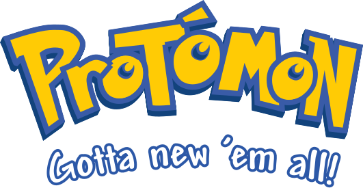
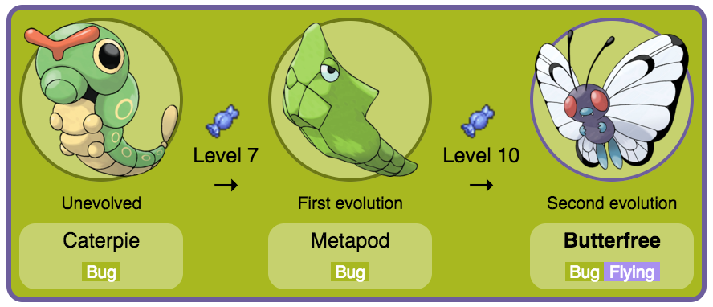
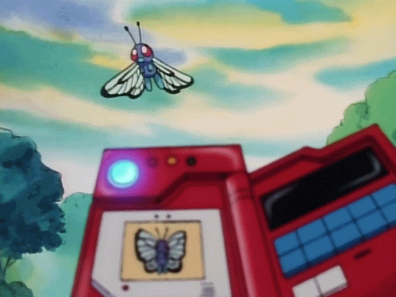

If you want to be the VERY BEST, like no programmer ever was, you must travel across the web, searching far and wide, for each prototype, to understand the power that's inside!

Keep reading to learn more about JavaScript prototypes, and some Pokémon trivia!

# You Caught a Prototype!

In episode three, [_Ash Catches a Pokémon_](http://www.pokemon.com/us/pokemon-episodes/01_03-ash-catches-a-pokemon/), Ash catches his first Pokémon; an unevolved Caterpie. Caterpie uses the String Shot and Tackle moves to defeat Team Rocket, and then evolves into Metapod. Ash's Pokédex notes that it has reached this stage more quickly than any other Caterpie on record!

In episode four, [_Challenge of the Samurai_](http://www.pokemon.com/us/pokemon-episodes/01_04-challenge-of-the-samurai/), Metapod uses the Harden move to defeat Samurai's Pinsir. Metapod then evolves into its final form, Butterfree, just in time to subdue an entire colony of angry Beedrill by using the Sleep Powder move.



# Let's code a Protodex!

Just like Ash can use his __Pokédex__ to keep track of the moves and evolution of __Pokémon__, we'll create a __Protodex__ to keep track of the moves and evolution of __Protomon__ (prototype monsters)!



Inside a file named `Protodex.js`, we code the following JavaScript functions:

```
var Protomon = function(initialLevel) { this.level = initialLevel || 1; };
Protomon.prototype.levelUp = function() { this.level++; };

var Caterpie = function() {}; // String Shot, Tackle
Caterpie.prototype = new Protomon();

var Metapod = function() {}; // Harden
Metapod.prototype = new Caterpie();

var Butterfree = function() {}; // Sleep Powder
Butterfree.prototype = new Metapod();
```

This code sets a foundation for our Protodex's knowledge of how Caterpie evolves into Metapod, and then Butterfree. Let's see what happens if we catch a Caterpie, and then level it up:

```
var firstCatch = new Caterpie(5);
firstCatch.levelUp();
console.log(firstCatch.level); // -> 6
```

Our first Protomon is a Caterpie and, after leveling it up, it is only one level away from evolving! Before leveling it up any further, our Protodex must be told how to evolve Caterpie into Metapod; so let's add to `Caterpie`:

```
...
```

| Protomon      | Moves               | Evolves  |
| ------------- |:-------------------:| --------:|
| Caterpie      | String Shot, Tackle |        7 |
| Metapod       | Harden              |       10 |
| Butterfree    | Sleep Powder        |        x |
